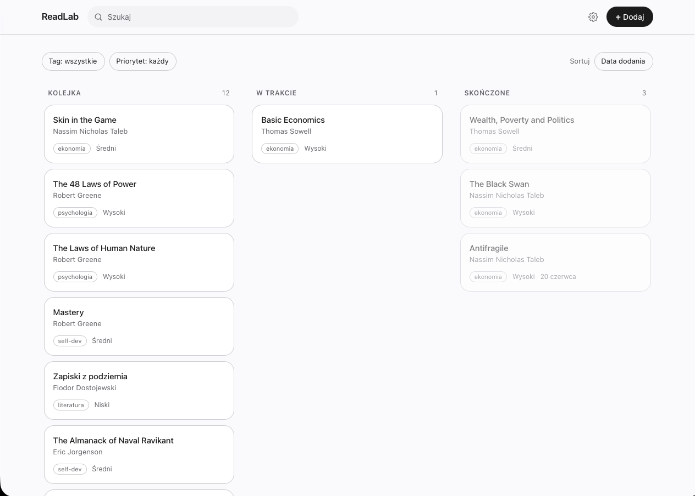
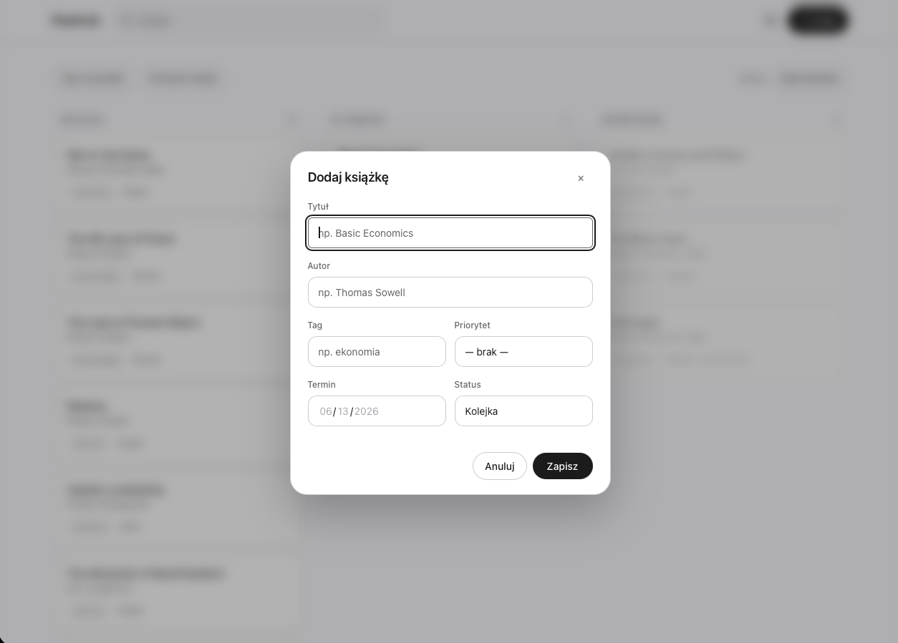
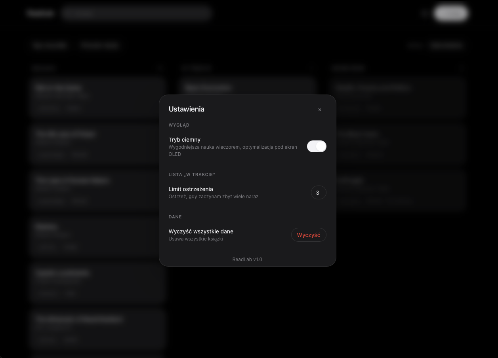
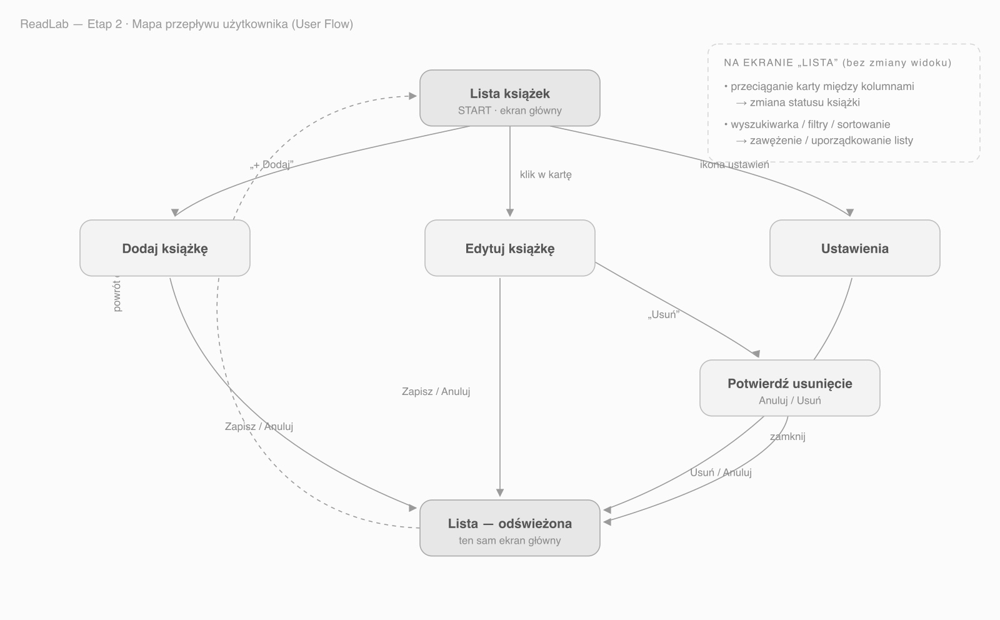

# ReadLab — dokumentacja projektu

Aplikacja typu _Task Management App_ w domenie samodzielnej nauki — **kolejka książek do
przeczytania** ze statusami **Kolejka → W trakcie → Skończone**.

- **Przedmiot:** Projektowanie Interfejsów Użytkownika · **Prowadzący:** mgr inż. Bartłomiej Kizielewicz
- **Wykonanie:** Gracjan Prusik, Bartłomiej Neumann
- **Technologie:** React + Tailwind CSS + localStorage (bez backendu)

## Linki do oddania

- **Repozytorium z kodem:** https://github.com/neumann1337/readlab
- **Prototyp w Figmie:** https://www.figma.com/proto/9Tbi3S1SnsvuC3lp2xbUmU/ReadLab?node-id=0-1&t=0ZM4tTjmjokpavum-1
- **Uruchomienie lokalne:** `cd app && npm install && npm run dev` → http://localhost:3000

---

## Jak wygląda aplikacja

**Ekran główny — kanban (Kolejka / W trakcie / Skończone)**



**Dodawanie książki (modal)**



**Tryb ciemny**



## 1. Opis problemu projektowego

Osoby uczące się samodzielnie gromadzą książki szybciej, niż są w stanie je przeczytać. Tytuły
rozsypane są po notatkach, zakładkach i kartkach; brakuje **jednego miejsca**, które jasno pokazuje:
co czytam teraz, co czeka w kolejce, co już skończyłem. Istniejące narzędzia są albo zbyt ciężkie
(Notion, Goodreads), albo zbyt ubogie (zwykła lista to-do nie rozróżnia „w trakcie" od „w kolejce").
ReadLab rozwiązuje dokładnie ten problem — bez zbędnych funkcji.

## 2. Persony użytkowników

**Persona A — „Samouk po godzinach" (28–32 lata, pracuje na etacie).** Uczy się wieczorami na
laptopie. Zapisuje kolejne książki szybciej, niż je kończy; zaczyna kilka naraz i gubi, co było
w połowie. Potrzebuje: statusu „W trakcie" z limitem, priorytetów, tagów, kolejki.

**Persona B — „Student w biegu" (20–23 lata).** Miesza lektury obowiązkowe z własnymi, zapomina
o terminach, dodaje materiały „na szybko". Potrzebuje: terminów, filtrowania, szybkiego dodawania,
wyszukiwarki.

## 3. Główny przepływ użytkownika

> Użytkownik otwiera aplikację → widzi, co ma „W trakcie" → klika **„+ Dodaj"** → wpisuje tytuł
> i autora → **Zapisz** → książka trafia do **Kolejki** → później przeciąga ją do **„W trakcie"**
> → po przeczytaniu do **„Skończone"**.

Przepływ obejmuje pełny wymagany CRUD (dodawanie, edycja, usuwanie, zmiana statusu, lista).


## 4. Najważniejsze wnioski z testów użyteczności

Testy przeprowadzono z **3 osobami** metodą „think aloud".
Testerzy: **T1** — studentka pielęgniarstwa, 22 lata (telefon); **T2** — kobieta, 48 lat, mało
obyta z aplikacjami (laptop); **T3** — student, 24 lata, biegły technicznie (laptop).

**Co działało dobrze.** Dodawanie książki było natychmiastowe dla wszystkich — wyraźny przycisk
„+ Dodaj" i tylko jedno pole wymagane (tytuł). Wyszukiwarka i filtry nie sprawiły problemów.
Podział na Kolejkę / W trakcie / Skończone był zrozumiały od pierwszego spojrzenia, a T2 doceniła
pytanie o potwierdzenie przy usuwaniu („dobrze, że pyta").

**Powtarzające się problemy.**
- **Przeciąganie kart nie było oczywiste** (T1 i T2): zamiast przeciągnąć kartę między kolumnami,
  obie otwierały ją i zmieniały pole „Status" w edycji. Ścieżka zadziałała, ale drag & drop
  pozostał nieodkryty. T3 użył przeciągania od razu.
- **Ikona ustawień (zębatka)** była dla T2 mało czytelna — potrzebowała chwili, by skojarzyć ją
  z ustawieniami / trybem ciemnym.

**Wprowadzone poprawki (wynikające z obserwacji).**
- Domyślna zakładka na telefonie ustawiona na **„Kolejka"** (wcześniej „W trakcie", która bywała
  pusta i myliła T1).
- Dodano **kursor „grab" i efekt chwytania** na kartach, by zasygnalizować możliwość przeciągania;
  zmiana statusu przez edycję pozostaje jako równorzędna alternatywa.

## 5. Uzasadnienie najważniejszych decyzji projektowych

- **Statusy Kolejka → W trakcie → Skończone** zamiast prostego „wykonane" — odwzorowują realny cykl
  życia książki i są rdzeniem wartości („coś więcej niż to-do"). Wynikają z frustracji Persony A.
- **Kanban (desktop) / zakładki (mobile)** — ta sama logika, dwa układy = responsywność bez utraty
  spójności.
- **Minimalizm wizualny (styl Apple)** — monochromatycznie, kolor tylko funkcjonalnie (czerwień
  terminu/usuwania), dużo przestrzeni, hairline'y. Realizuje zasady _prostota_ i _spójność_.
- **Tylko tytuł wymagany** w formularzu — szybkie dodawanie (Persona B); reszta opcjonalna.
- **Potwierdzenie usuwania** — ochrona przed przypadkową utratą danych (_dostępność_).
- **localStorage zamiast backendu** — zgodne z wymaganiami; cały wysiłek idzie w UX/UI.

---

## Zakres funkcjonalny

**Wymagany (CRUD):** dodawanie, edycja, usuwanie książki, zmiana statusu (Kolejka → W trakcie →
Skończone), wyświetlanie listy.
**Rozszerzony:** wyszukiwarka, filtrowanie (tag / priorytet), sortowanie, tagi, priorytety, terminy
z ostrzeżeniem, tryb ciemny, walidacja formularzy, zapis w `localStorage`.
**Responsywność:** desktop — kanban (3 kolumny, drag & drop); mobile — segmentowany przełącznik statusów.

## Zasady dobrego UI przyjęte w projekcie

**Prostota** (jedna główna akcja na ekranie), **intuicyjność** („+" zawsze dodaje, kosz zawsze
usuwa), **spójność** (jeden zestaw komponentów i kolorów), **dostępność** (kontrast, obsługa
klawiatury, tryb ciemny).

## Uruchomienie aplikacji

```bash
cd app
npm install
npm run dev        # http://localhost:3000
```

> Wymagany Node.js w wersji 20.19+ lub 22.12+.
