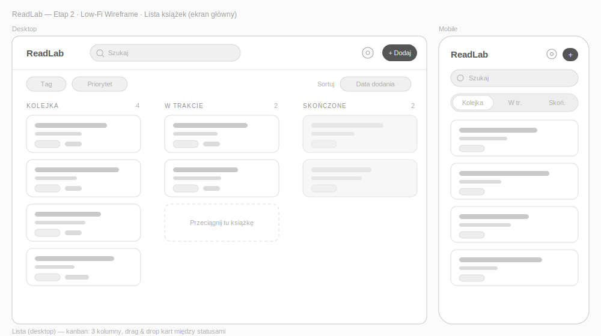
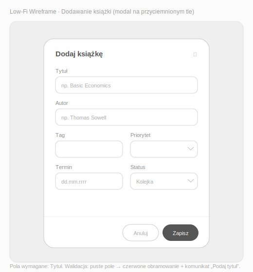
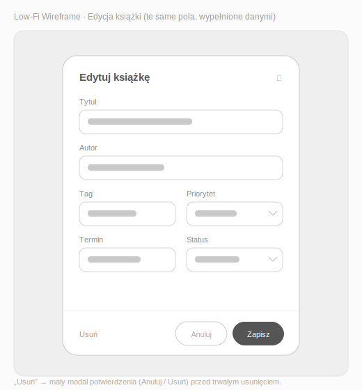
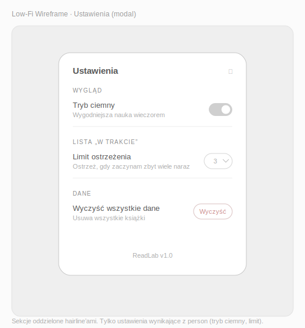
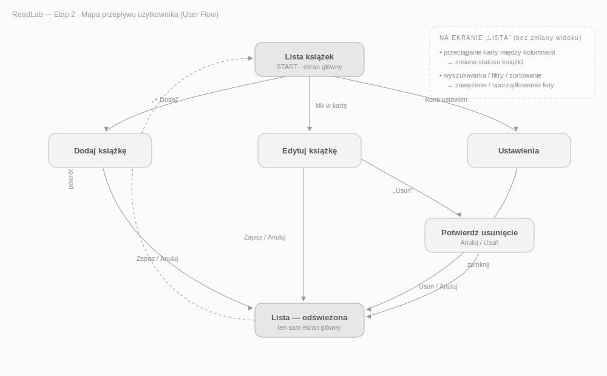

# Etap 2 — Szkice interfejsu (Low-Fi) i mapa User Flow

Projekt: **ReadLab** — kolejka książek do przeczytania

## Szkice Low-Fidelity (pliki)

Wireframe'y wszystkich wymaganych widoków znajdują się w katalogu [`assets/`](../assets)
jako pliki **SVG** (wektorowe, czysto Low-Fi: szare bloki, placeholdery tekstu, bez kolorów
i finalnej typografii). Otwórz je w przeglądarce lub Figmie.

| Widok | Plik |
|-------|------|
| Lista książek (desktop + mobile) | [`wireframe-01-lista.svg`](../assets/wireframe-01-lista.svg) |
| Dodawanie książki | [`wireframe-02-dodawanie.svg`](../assets/wireframe-02-dodawanie.svg) |
| Edycja książki | [`wireframe-03-edycja.svg`](../assets/wireframe-03-edycja.svg) |
| Ustawienia | [`wireframe-04-ustawienia.svg`](../assets/wireframe-04-ustawienia.svg) |
| Mapa User Flow | [`user-flow.svg`](../assets/user-flow.svg) |







### Import do Figmy

Pliki przygotowane są pod Figmę (style wpisane bezpośrednio w elementy, teksty jako warstwy
tekstowe, strzałki jako kształty — nie markery). Aby zaprezentować je w Figmie:

1. Otwórz nowy plik w Figmie.
2. **Przeciągnij plik `.svg` z Findera prosto na kanwę** (każdy ekran osobno) — wklei się jako
   grupa edytowalnych wektorów i warstw tekstowych.
3. Zaznacz wklejoną grupę → prawy przycisk → **„Frame selection”**, żeby każdy ekran był osobną
   ramką (Frame) — wygodne do prezentacji i do Etapu 3.
4. (Opcjonalnie) w zakładce **Prototype** połącz ramki strzałkami wg mapy `user-flow.svg`,
   tworząc klikalny przepływ.

Poniżej **szczegółowa specyfikacja każdego ekranu** (układ, lista elementów, uzasadnienie
person/zasad UI) — stanowi opis do powyższych szkiców i podstawę do Etapu 3 (prototyp w Figmie).
Każdy ekran ma:

- **referencyjny szkic ASCII** (układ w skrócie),
- **listę elementów** (numerowaną),
- **uzasadnienie** (która persona / zasada UI tego wymaga).

> Zasada Low-Fi: **bez kolorów, bez prawdziwych fontów, bez ikon docelowych.** Szare prostokąty,
> kreski zamiast tekstu lub placeholdery „Tytuł", „[Przycisk]". Chodzi o **układ i hierarchię**,
> nie o estetykę — tę robimy w Etapie 3.

---

## Ekrany do narysowania (wymagane przez dokument)

1. Lista zadań (ekran główny) — **desktop + mobile**
2. Dodawanie zadania (modal/formularz)
3. Edycja zadania (modal/formularz)
4. Ustawienia

Dodatkowo: **mapa User Flow** (na końcu).

---

## 1. Lista zadań — widok DESKTOP (ekran główny)

```
+-------------------------------------------------------------------+
|  ReadLab                           [ Szukaj... ]    [ + Dodaj ]   |  <- pasek górny
+-------------------------------------------------------------------+
|  Filtry:  [ Tag v ] [ Priorytet v ]   Sortuj: [ v ]              |  <- pasek filtrów
+-------------------------------------------------------------------+
|                                                                   |
|   KOLEJKA (5)        |   W TRAKCIE (2)       |   SKOŃCZONE (8)     |  <- 3 kolumny (kanban)
|  +---------------+   |  +---------------+    |  +---------------+  |
|  | Tytuł         |   |  | Tytuł         |    |  | Tytuł         |  |
|  | autor/tag     |   |  | autor/tag     |    |  | autor/tag     |  |
|  | ! priorytet   |   |  | ! priorytet   |    |  | (wyszarzone)  |  |
|  +---------------+   |  +---------------+    |  +---------------+  |
|  +---------------+   |  +---------------+    |                     |
|  | ...           |   |  | ...           |    |                     |
|  +---------------+   |  +---------------+    |                     |
|                                                                   |
+-------------------------------------------------------------------+
```

**Elementy:**

1. Logo / nazwa „ReadLab" (lewy górny róg).
2. Pole **wyszukiwarki** (góra, środek).
3. Przycisk **„+ Dodaj"** (prawy górny róg — zawsze ta sama akcja → zasada _intuicyjność_).
4. Pasek **filtrów** (tag, priorytet) + **sortowanie**.
5. **Trzy kolumny statusów**: Kolejka / W trakcie / Skończone, każda z licznikiem w nagłówku.
6. **Karta książki** (powtarzalny komponent): tytuł, autor, tag (mały tekst), wskaźnik priorytetu lub terminu.
7. Karta w „Skończone" jest **wyszarzona** (wizualne domknięcie).
8. (opcja) pusta kolumna pokazuje placeholder „Przeciągnij tu książkę".

**Interakcje do zaznaczenia strzałkami na szkicu:**

- klik „+ Dodaj" → otwiera ekran 2,
- klik w kartę → otwiera ekran 3 (edycja),
- przeciągnięcie karty między kolumnami → zmiana statusu.

**Uzasadnienie:** widok kanban realizuje „coś więcej niż to-do" (status Kolejka→W trakcie→Skończone).
Trzy kolumny + liczniki = Persona A widzi od razu, czy nie zaczęła za dużo („W trakcie").
Filtry/sortowanie/wyszukiwarka = Persona B przy rosnącej liście. Zasada: _prostota_ (jedna główna akcja: „+").

---

## 2. Lista zadań — widok MOBILE

```
+----------------------+
| ReadLab        [ + ] |   <- nazwa + przycisk dodawania
+----------------------+
| [ Szukaj...        ] |
+----------------------+
| [Kolejka][W tr.][Skoń]|  <- zakładki statusów (taby) zamiast 3 kolumn
+----------------------+
| [ Filtr ]  [ Sortuj ]|
+----------------------+
| +------------------+ |
| | Tytuł            | |
| | autor/tag        | |
| | ! priorytet      | |
| +------------------+ |
| +------------------+ |
| | ...              | |
| +------------------+ |
+----------------------+
```

**Różnice względem desktopu (ważne — to pokazuje responsywność, wymóg Etapu 5):**

1. Trzy kolumny **nie mieszczą się** → zamieniamy je na **zakładki (taby)**: Kolejka / W trakcie / Skończone. Widać jedną listę naraz.
2. Przycisk dodawania to samo **„+"** (ikona) w prawym górnym rogu (lub FAB — pływający przycisk w prawym dolnym rogu).
3. Filtry chowamy za przyciskiem „Filtr" (panel wysuwany), żeby nie zajmowały ekranu.
4. Karty na pełną szerokość, jedna pod drugą.

**Uzasadnienie:** Persona B jest **mobile-first** — dodaje w biegu. Zmiana kolumn na taby to
klasyczny wzorzec responsywny; zachowuje _spójność_ funkcji przy zmianie rozmiaru.

---

## 3. Dodawanie zadania (modal / formularz)

```
+---------------------------------+
|  Dodaj książkę             [ x ]|
+---------------------------------+
|  Tytuł *                        |
|  [_____________________________]|
|                                 |
|  Autor      [____________]      |
|  Tag        [____________]      |
|  Priorytet  [ Niski v ]         |
|  Termin     [ __.__.____ ]      |
|                                 |
|  Status     [ Kolejka v ]       |
|                                 |
|        [ Anuluj ]  [ Zapisz ]   |
+---------------------------------+
```

**Elementy:**

1. Tytuł modala + przycisk zamknięcia „x".
2. **Tytuł** — pole tekstowe, **wymagane** (gwiazdka).
3. **Autor** — pole tekstowe, opcjonalne.
4. **Tag** — pole tekstowe, opcjonalne.
5. **Priorytet** — lista rozwijana (niski/średni/wysoki), opcjonalny.
6. **Termin** — wybór daty, opcjonalny.
7. **Status** — domyślnie „Kolejka".
8. Przyciski **Anuluj** / **Zapisz** (Zapisz wyróżniony jako główny).

**Stan błędu do narysowania (osobny mały szkic):** pole „Tytuł" puste → czerwona obwódka +
komunikat „Podaj tytuł". Przycisk „Zapisz" nieaktywny dopóki wymagane pola puste.

**Uzasadnienie:** tylko tytuł jest wymagany = **szybkie dodawanie** (Persona B, _prostota_).
Reszta opcjonalna, żeby nie blokować. Walidacja = rozszerzony zakres + zasada _intuicyjność_
(użytkownik od razu wie, co poprawić).

---

## 4. Edycja zadania (modal / formularz)

```
+---------------------------------+
|  Edytuj książkę            [ x ]|
+---------------------------------+
|  (te same pola co w dodawaniu,  |
|   ale WYPEŁNIONE danymi)        |
|  Tytuł * [ Basic Economics    ] |
|  Autor   [ Thomas Sowell     ]  |
|  Tag     [ ekonomia          ]  |
|  ...                            |
+---------------------------------+
|  [ Usuń ]        [Anuluj][Zapisz]|
+---------------------------------+
```

**Różnice względem dodawania:**

1. Tytuł modala: „Edytuj książkę".
2. Pola **wstępnie wypełnione** istniejącymi danymi.
3. Dodatkowy przycisk **„Usuń"** (po lewej, wizualnie oddzielony — np. czerwony tekst).
4. Klik „Usuń" → **dialog potwierdzenia** „Na pewno usunąć? [Anuluj] [Usuń]” (narysuj jako mały osobny szkic).

**Uzasadnienie:** edycja i usuwanie to wymagany CRUD. Potwierdzenie usuwania chroni przed
przypadkową utratą danych (_dostępność_/bezpieczeństwo użycia). Ten sam layout co dodawanie =
_spójność_ (jeden komponent formularza).

---

## 5. Ustawienia

```
+----------------------------------+
|  < Ustawienia                    |
+----------------------------------+
|  Wygląd                          |
|    Tryb ciemny        [ ON/OFF ] |
|                                  |
|  Lista „W trakcie"               |
|    Limit ostrzeżenia  [ 3  v ]   |
|                                  |
|  Dane                            |
|    [ Wyczyść wszystkie dane ]    |
|                                  |
|  O aplikacji                     |
|    ReadLab v1.0                |
+----------------------------------+
```

**Elementy:**

1. Nagłówek + powrót („<”).
2. **Przełącznik trybu ciemnego** (rozszerzony zakres + _dostępność_).
3. **Limit „W trakcie"** — po ilu pozycjach pokazać ostrzeżenie (domyślnie 3) — funkcja dla Persony A.
4. **Wyczyść dane** — reset localStorage (z potwierdzeniem).
5. Wersja aplikacji.

**Uzasadnienie:** ustawienia trzymamy minimalne — tylko to, co wynika z person (tryb ciemny =
nauka wieczorem; limit = problem Persony A z zaczynaniem zbyt wielu rzeczy). _Prostota_ = nie
wrzucamy opcji „bo można".

---

## 6. Mapa User Flow (przepływ użytkownika)

Narysuj jako diagram prostokątów (ekrany) połączonych strzałkami (akcje). Tekstowa wersja
do przerysowania:

```
                       [ START / Lista zadań ]
                                |
        +-----------------------+------------------------+
        |                       |                        |
   klik "+ Dodaj"         klik w kartę              klik "Ustawienia"
        |                       |                        |
        v                       v                        v
 [ Dodaj książkę ]       [ Edytuj książkę ]         [ Ustawienia ]
   |          |             |        |                   |
 Zapisz    Anuluj       Zapisz    Usuń               zmiana opcji
   |          |             |        |                   |
   v          v             v        v                   v
[ Lista ]  [ Lista ]    [ Lista ] [potwierdź] -----> [ Lista ]
                                      |
                              Usuń -> [ Lista ]

  Dodatkowo na Liście (bez zmiany ekranu):
   - przeciągnięcie karty między kolumnami -> zmiana statusu
   - wpisanie w wyszukiwarkę -> filtrowanie listy na żywo
   - wybór filtra/sortowania -> przeładowanie listy
```

**Najważniejszy przepływ (to opisz w dokumentacji jako „główny User Flow"):**

> Użytkownik otwiera aplikację → widzi co ma „W trakcie" → klika „+ Dodaj" → wpisuje tytuł i autora
> → Zapisz → materiał ląduje w „Kolejce” → później przeciąga go do „W trakcie” → po przeczytaniu
> do „Skończone”.

To pokazuje pełny cykl życia materiału i obejmuje cały wymagany CRUD + zmianę statusu.

---

## Checklista oddania Etapu 2 (zrealizowane)

- [x] Lista zadań — desktop (`wireframe-01-lista.svg`)
- [x] Lista zadań — mobile, taby zamiast kolumn (`wireframe-01-lista.svg`)
- [x] Dodawanie (`wireframe-02-dodawanie.svg`)
- [x] Edycja, z przyciskiem „Usuń" (`wireframe-03-edycja.svg`)
- [x] Ustawienia (`wireframe-04-ustawienia.svg`)
- [x] Mapa User Flow ze strzałkami (`user-flow.svg`)
- [x] Uzasadnienie person/zasad UI pod każdym ekranem (sekcje „Uzasadnienie” powyżej)

Wszystkie szkice znajdują się w `assets/` jako pliki SVG gotowe do importu w Figmie (Etap 3).
